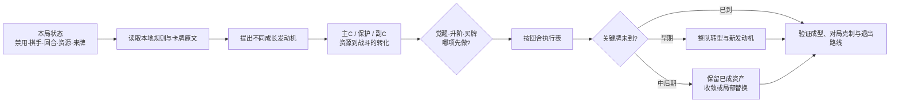

# wanxiang-build · 王者万象棋阵容构筑分析 Skill

面向 Codex 和兼容 Skill 规范的 Agent 的《王者万象棋》阵容研究工具。它把本地规则、英雄卡、效果牌、天赋、装备和棋手资料连接到一套可解释的运营分析流程：先回答这一回合该买什么、升不升级、追不追觉醒，再解释成长资源如何转化为主 C 的输出窗口、保护能力和关键击杀。

它的目标不是复述热门攻略，而是在明确禁用、来牌、资源和对手条件后，找出有证据支持的路线，并在关键牌不来时给出整队转型分支。

卡牌与规则资料来源于游戏对局记录、游戏内文档、游戏官网文档，以及[万象棋知识站](https://wanxiangqiwiki.com/)。不同来源的内容会在本地资料中交叉核对；当规则或字段存在未确认之处时，Skill 会保留假设和适用边界，不将策略推论冒充游戏规则。

快速入口：[Skill 指令](skills/wanxiang-build/SKILL.md) · [规则与资料边界](skills/wanxiang-build/references/sources.md) · [评分规则](skills/wanxiang-build/references/scoring.md) · [战斗转化评估](skills/wanxiang-build/references/combat-evaluation.md) · [觉醒 / 升阶机会成本](skills/wanxiang-build/references/investment.md)

## 如何使用

在支持 Codex Skill 的 Agent 中，最稳定的触发方式是在问题中写出 `$wanxiang-build`。可以把它放在提问开头，也可以放在正文中；Skill 名称后直接接你的局面和目标即可。支持自动发现 Skill 的环境也可以直接描述任务，但显式写出名称更容易确保使用本 Skill。

### 从零构筑提问

```text
1.使用 $wanxiang-build。在禁用__阵营的前提下，从零设计一套构筑。
2.帮我设计一套最适配__棋手的构筑。
3.使用__棋手和__阵营，帮我设计一套最优构筑。
```

### 实战决策提问（不推荐）

```text
使用 $wanxiang-build，分析本局阵营“____”被禁、棋手为“____”、当前第 R__ 回合。
已上场：____；手牌：____；商店：____；能量：____；血量：____；装备/天赋：____；已知对手：____。
请先给按回合的买牌、升阶、刷新、觉醒和转型决策树，再给成长、战斗转化、评分和失败条件。
```

> skill虽然具备对局中分析能力，但分析过程太久不适合实战使用

## 能做什么

| 能力 | 交付内容 |
| --- | --- |
| 规则与卡牌检索 | 从随 Skill 携带的本地资料中定位完整父记录、技能、觉醒卡、预览卡和关联子卡 |
| 成长引擎分析 | 追踪棋手、英雄、装备、天赋和效果牌产生的能量、等级、复制与重放链路 |
| 主 C 战斗转化 | 结合属性成长、技能强化、攻击/抗性、目标访问、保护和减员反馈判断资源是否兑现 |
| 觉醒 / 升阶取舍 | 把 9 点觉醒能量、卡池延迟、高阶卡槽机会、锦囊收益和战斗收益放在同一条运营路径比较 |
| 效果锦囊联动 | 按独立三槽、三选一规则评估效果牌与当前牌组的增量价值，不以品阶替代联动分析 |
| 缺牌与禁用转型 | 随开局随机禁用和实际来牌分叉；早期允许更换整套成长发动机，后期逐渐收敛 |
| 功能位退出 | 评估经济 / 检索牌何时停止追加、暂留、转移或出售，避免后期继续占用无效位置 |
| 可解释评分 | 以 8 个维度汇总为 100 分的理论决策评分，并保留证据、假设、区间和翻转条件 |

## 分析思路



流程有几个固定原则：

- 每局先排除被随机禁用阵营的英雄；禁用未知时给出按阵营拆分的适用条件，不把多套禁用同时叠加。
- 队伍总等级只记录资源规模，不直接代表战力。集中培养主 C 可能更快形成击杀窗口，分散成长也可能在保护和持续作战上更好，必须按属性、技能和战斗事件比较。
- 对四阶以上主 C、三阶以上构筑牌检查“没刷到”的整队路线，而不是只列一个替代挂件。
- 升阶后的新卡池下一回合才生效；本回合不能用手动刷新提前获得新池。
- 效果锦囊独立于英雄公共卡池，没有张数消耗；打开锦囊消耗 1 张，三个卡槽的品阶独立抽取，最后三选一。
- 经济和检索牌从买入时就规划停投与退出。基础收入提高会改变边际价值，但不会自动证明它们应该淘汰；是否仍能改变有效行动才是判断依据。
- 检索、指纹和算术复核由 Skill 内部完成，不能代替 Agent 解释卡文、提出阵容或完成战斗判断。

## 仓库内容

```text
.
├─ skills/wanxiang-build/
│  ├─ SKILL.md                         # Skill 入口与路由规则
│  ├─ agents/openai.yaml               # Codex 界面名称与默认提示词
│  ├─ data/
│  │  ├─ documents/                    # 规则与卡牌原文
│  │  └─ references/                   # 官方 / 热门阵容，仅作比较基线
│  ├─ references/                      # 分析方法、评分、战斗与投资规则
│  └─ source_config.json               # 默认资料根目录：data/
└─ README.md
```

当前随 Skill 携带的资料快照包括：85 名英雄、98 张效果牌、255 张天赋牌、73 张装备牌、18 名棋手、5 套官方推荐阵容和 21 份其他参考阵容数据，以及规则、成长、技能、召唤物和伤害抗性说明。参考阵容用于提出和对照假设，不是权威强度排名。

## 安装

### 项目级安装（推荐）

项目级安装只影响当前项目，适合把规则资料和研究报告一起纳入版本管理。

1. 克隆本仓库。
2. 将仓库中的 `skills/wanxiang-build` 复制到目标项目的 `.agents/skills/wanxiang-build`。
3. 在目标项目中重新打开或刷新 Agent 会话，然后使用 `$wanxiang-build`。

PowerShell：

```powershell
git clone <仓库地址> wanxiang-build
New-Item -ItemType Directory -Force .agents\skills | Out-Null
Copy-Item -Recurse -Force `
  .\wanxiang-build\skills\wanxiang-build `
  .\.agents\skills\wanxiang-build
```

macOS / Linux：

```bash
git clone <仓库地址> wanxiang-build
mkdir -p .agents/skills
cp -R wanxiang-build/skills/wanxiang-build .agents/skills/
```

如果目标项目本身就是这个仓库，保持现有的 `skills/wanxiang-build` 目录即可；发布到 GitHub 时不要只上传 `SKILL.md`，完整的 `data/`、`references/` 和 `agents/openai.yaml` 也需要一并保留。

### 全局安装（可选）

如果希望所有项目都能发现该 Skill，将同一个目录复制到 Codex 的全局 Skill 目录：

```text
<CODEX_HOME>/skills/wanxiang-build/
```

未设置 `CODEX_HOME` 时通常使用用户目录下的 `.codex/skills/wanxiang-build/`。项目级目录优先携带与项目匹配的资料版本，更新资料前请确认报告所依据的快照。

## 版本更新与替换数据源

游戏版本更替时，真正的规则和卡牌数据位于 `skills/wanxiang-build/data/documents/`。将新版本的同名文件覆盖到这个目录即可；不要只替换 `data/references/`，后者仅保存官方、热门和综合推荐阵容，属于比较基线。

建议按下面的顺序更新：

1. **保留旧快照。** 先用 Git 建立版本分支或标签，或者复制一份旧的 `data/` 目录，方便回溯旧报告所依据的规则。
2. **覆盖原始资料。** 将新版本中发生变化的规则、英雄、效果牌、天赋、装备、棋手、成长、技能、召唤物和伤害抗性文件，逐个覆盖到 `data/documents/`。保持 UTF-8 编码、原有文件名和 JSON 字段结构；若文件新增或删除，确认后再同步目录，避免留下已废弃的旧记录。
3. **按需更新参考阵容。** 只有官方或社区构筑资料发生变化时，才替换 `data/references/` 中对应的 JSON。参考阵容不会改变规则优先级，也不会自动成为推荐答案。
4. **检查资料结构。** 如果新版本改变了文件名或 JSON 顶层结构，需要同步 Skill 的内部资料映射；仅更新内容和同名字段时通常不需要调整内部实现。分析流程变更才修改 `references/`，不要把某个版本的数值写进分析方法。
5. **记录版本指纹。** 更新 `skills/wanxiang-build/references/sources.md` 的快照日期、变更说明和适用范围，并保存新的文件数量与 SHA-256 指纹。
6. **完成校验后再重评。** 运行项目提供的内部结构与资料校验；凡是涉及被改规则、卡牌、棋手、卡池、经济或战斗公式的旧报告，都要重新核算路径和评分，不能只更新报告日期。

PowerShell 示例（假设 `new-version/data/documents/` 是一份已核对的新资料目录；若它不是完整目录，请改为逐个复制变更文件）：

```powershell
$skill = ".\skills\wanxiang-build"
Copy-Item -Recurse -Force .\new-version\data\documents\* "$skill\data\documents\"
```

macOS / Linux 示例：

```bash
skill=./skills/wanxiang-build
cp -Rf new-version/data/documents/* "$skill/data/documents/"
```

如果新版本资料不再使用当前文件名或字段，请先调整 Skill 的内部资料映射并完成校验，再开始阵容研究。更新过程不会自动迁移历史评分；历史报告应保留原版本标记，新报告明确引用新的资料快照。

## 评分口径

默认使用 `wxq-rubric-1`：战力兑现、生存与保护、持续成长、成型效率、资源效率、针对与覆盖、缺件与转型、淘汰压力 8 个维度，总分 100。它是同一场景下的理论决策评分，不是胜率、吃鸡率或统计置信区间。

报告会把以下内容分开呈现：

- 当前已经兑现的战斗作用；
- 从当前回合开始仍可兑现的成长机会；
- 觉醒、升阶、过牌、效果锦囊和人口之间的机会成本；
- 关键牌未到、对手克制、低血无法等待和功能位退出失败等翻转条件。

因此，分数高并不等于任何局面都应照抄；它必须连同适用条件、证据来源和执行回合一起阅读。

## 资料与版本边界

本仓库保存的是项目内的本地资料快照，规则和卡牌更新后应重新核对涉及的结论。`data/references/` 中的官方与热门阵容是研究对照物，不作为权威依据；Skill 的分析目标是发现更强或更稳健的条件性方案。

当前 Skill 不承诺线上版本同步、实测胜率或完整战斗模拟。遇到原文没有说明的抽样、取整、临时等级连锁、传承细节或召唤物字段，Agent 应保留未知项、给出边界或翻转阈值，而不是用经验补成确定规则。

## 参与改进

欢迎提交新的规则补充、可复核的卡牌数据、实战局面和失败案例。修改规则时请同时更新对应的 `data/documents/` 原文、`references/` 分析约束和版本说明；修改内部辅助逻辑后请用真实资料运行一次校验。提交阵容研究时，请保留假设、逐回合路径和评分证据，避免只提交一个没有运营过程的终局名单。
